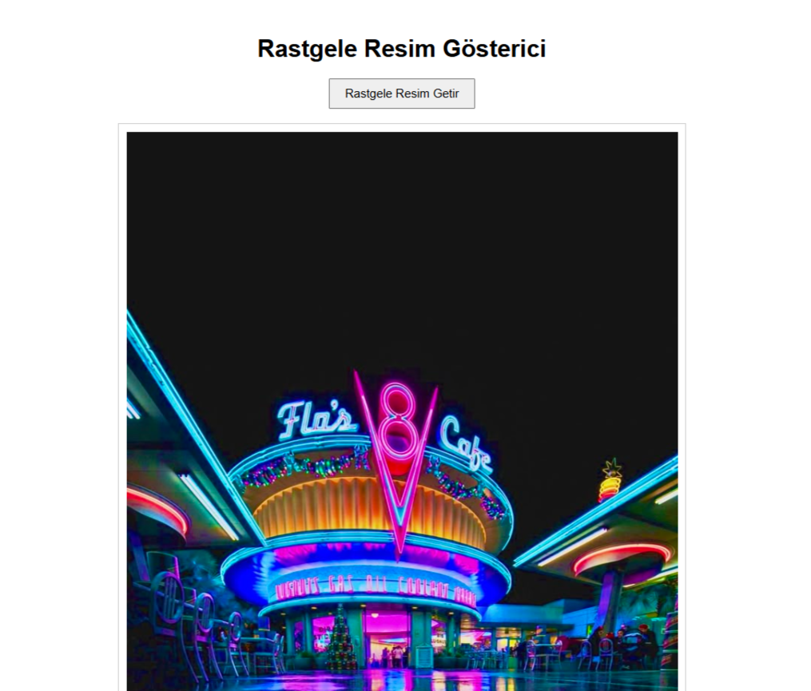
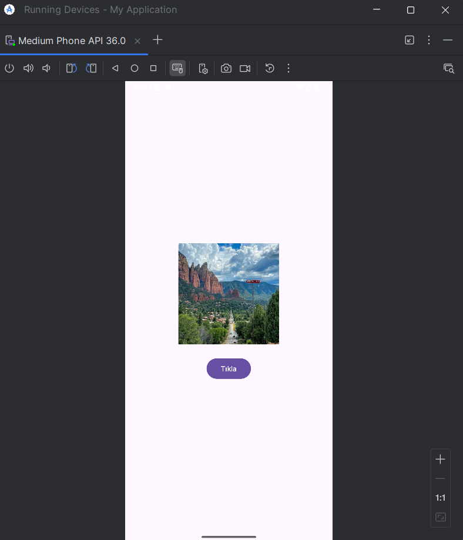
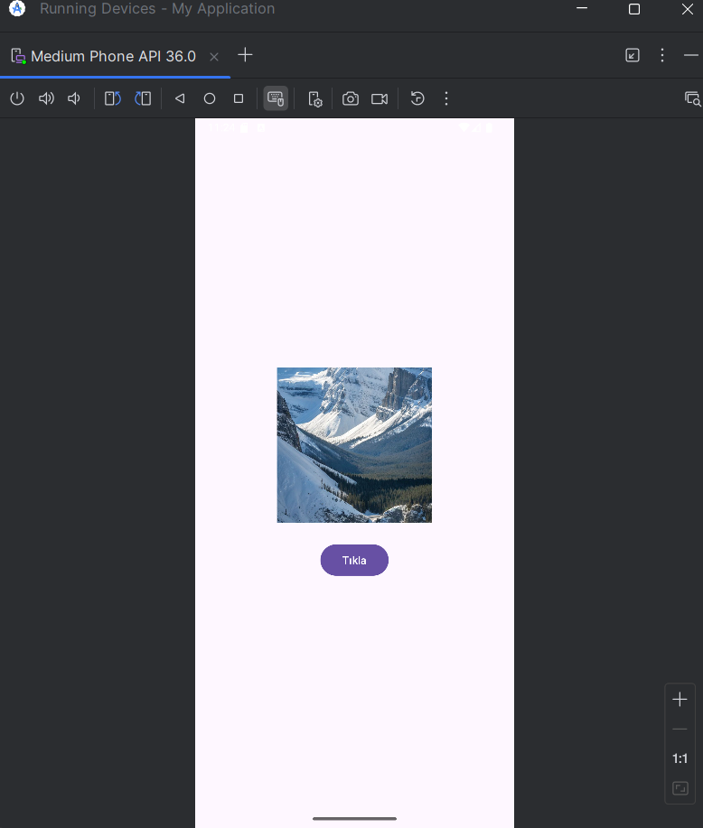

<h1>Random Image API App</h1>
<ul>
  <li>
    <strong>Projenin Amacı:</strong> Node.js ile bir sunucu kurarak resim API’si oluşturmak ve bu API'den mobil uygulamaya veri çekmek.
  </li>
  <li>
    Bu projede, sunucuma yüklediğim resimleri kullanarak basit bir <strong>Image API</strong> oluşturdum.
  </li>
  <li>
    Hazırladığım bu API sayesinde, rastgele resim verisi döndüren bir mobil uygulama geliştirdim.
  </li>
  
</ul>

 

## Uygulama Görselleri
|             Sunucu Resmi             |          Mobil Uygulama Görseli 1         |        Mobil Uygulama Görseli 1          |
| :----------------------------------: | :---------------------------------------: |:---------------------------------------: |
|                |                  |                 |

<h1>Kullanılan Teknolojiler</h1>
<ul>
  <li>Node.js / Express.js (Sunucu Yapısı)</li>
  <li>Kotlin / XML (Mobil Uygulama)</li>
  <li>HTML (sunucu arayüzü)</li>
</ul>

